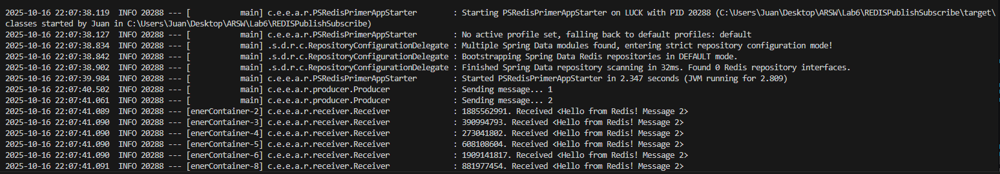

# Redis Publish/Subscribe with Spring Boot

## Overview

This project demonstrates the Publish/Subscribe messaging pattern using Redis as a message broker and Spring Boot for application management and configuration.

In this architecture:

* A Producer publishes messages to a Redis channel (PSChannel).

* Multiple Receivers (listeners) are subscribed to the same channel.

* Each time a message is published, all receivers get a copy of it simultaneously.

This lab showcases how Spring simplifies asynchronous communication between components using Redis as a lightweight message broker.

## Technologies Used

Java 8+

Spring Boot 2.3.1

Spring Data Redis

Maven

Docker

Redis (via Docker container)

## Project Structure

```plaintext

src/
 └── main/
     ├── java/
     │   └── co/edu/escuelaing/arsw/redispubsubprimer/
     │       ├── PSRedisPrimerAppStarter.java          # Main Spring Boot app
     │       ├── connection/
     │       │   ├── PSRedisConnectionConfiguration.java
     │       │   ├── PSRedisListenerContainer.java
     │       │   └── PSRedisTemplate.java
     │       ├── producer/
     │       │   └── Producer.java
     │       └── receiver/
     │           └── Receiver.java
     └── resources/
         └── application.properties                    # Redis configuration

```

## Run the Project

1. Clone the Project

    git clone https://github.com/Enigmus12/REDISPublishSubscribe.git

2. Start a Redis Instance with Docker

    docker run --name some-redis -p 45000:6379 -d redis

You can check that Redis is running using:

    docker ps

3. Build the Project

mvn clean install

4. Run the Application

mvn spring-boot:run

## Example Output

1. 



2. 


3. 


## Author

Juan David Rodríguez
Escuela Colombiana de Ingeniería Julio Garavito


